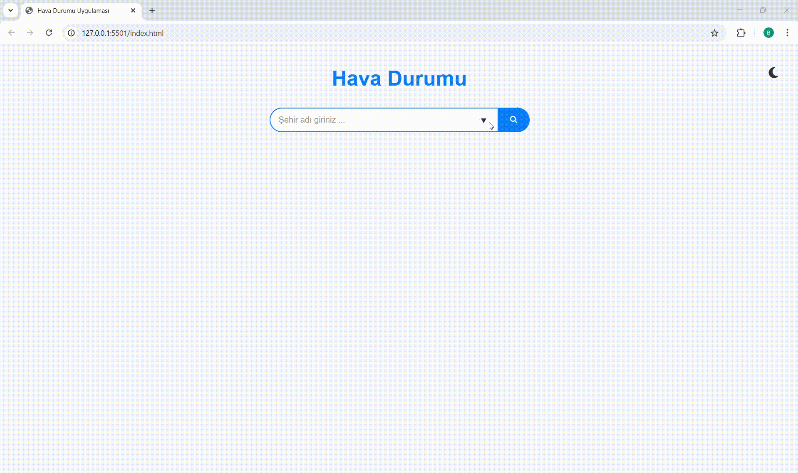

# Weather App

Bu, kullanıcıların anlık hava durumu verilerine erişebileceği basit bir hava durumu uygulamasıdır. Uygulama, bir hava durumu API'si kullanarak, kullanıcının belirttiği konum için hava durumu bilgilerini alır ve görsel olarak sunar.

## Özellikler

- **Hava Durumu Görüntüleme**: Kullanıcılar, belirledikleri şehir için anlık hava durumu verilerini görüntüleyebilir.
- **Sıcaklık, Nem ve Rüzgar Hızı**: Şehir için sıcaklık, nem oranı ve rüzgar hızı gibi veriler gösterilir.
- **API Entegrasyonu**: Gerçek hava durumu verisi, OpenWeatherMap API'si gibi bir hava durumu API'si aracılığıyla alınır.
- **Mobil Uyumluluk**: Uygulama, mobil cihazlarla uyumludur ve responsive tasarıma sahiptir.

## Ekran Görümtüsü

